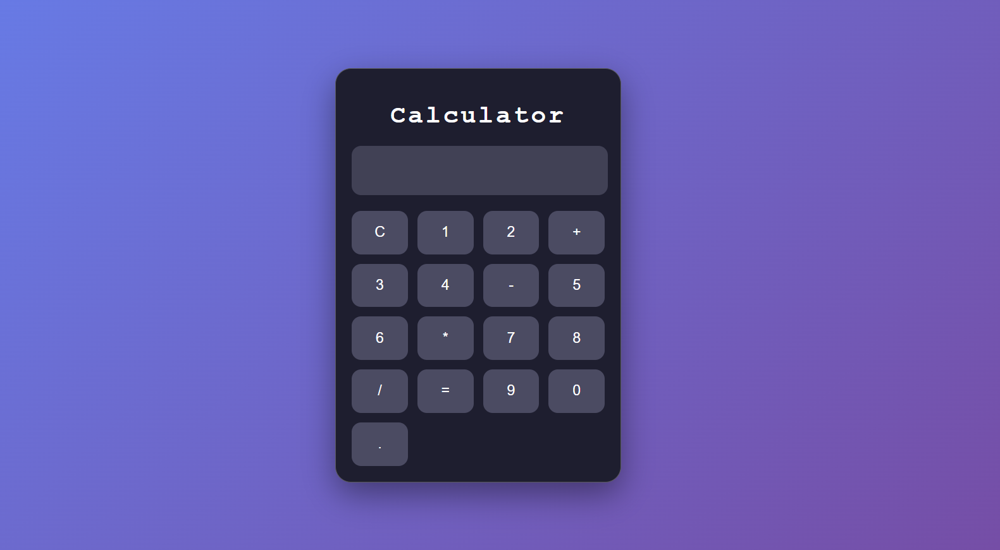

# 🧮 React Calculator App

A modern and responsive Calculator application built using **React.js** and **CSS Modules**.  
This project performs basic arithmetic operations with a clean and professional UI.

---

## 🚀 Live Demo

(Add your deployed link here if you deploy on Vercel / Netlify)

Example:
https://your-calculator-app.vercel.app/

---

## 📸 Screenshot

(Add your screenshot image in project folder and use below line)



---

## ✨ Features

- ➕ Addition
- ➖ Subtraction
- ✖ Multiplication
- ➗ Division
- 🧹 Clear (C) button
- 🎨 Modern dark theme UI
- 📱 Responsive layout
- ⚛ Built with React Functional Components
- 🔁 State management using `useState`

---

## 🛠 Technologies Used

- React.js
- JavaScript (ES6)
- CSS Modules
- Vite
- HTML5

---

## 📂 Project Structure

```
react-calculator/
│
├── src/
│   ├── components/
│   │   ├── Display.jsx
│   │   ├── Display.module.css
│   │   ├── ButtonsContainer.jsx
│   │   ├── ButtonsContainer.module.css
│   │
│   ├── App.jsx
│   ├── App.module.css
│   └── main.jsx
│
├── package.json
├── README.md
└── screenshot.png
```
